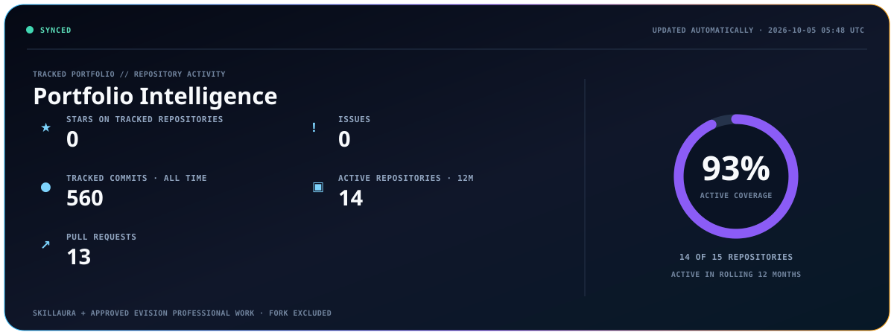
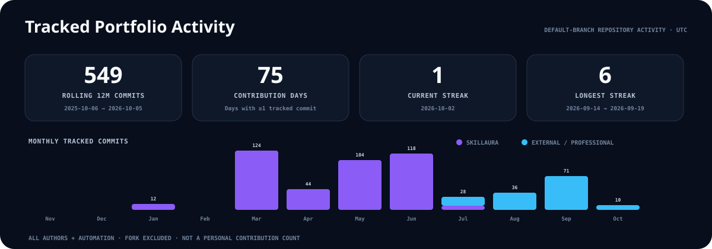
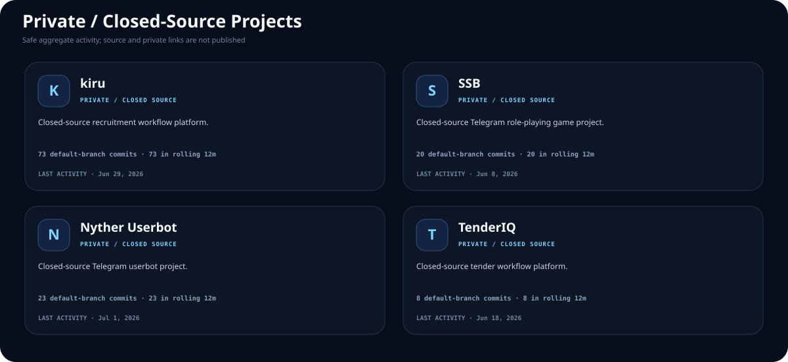
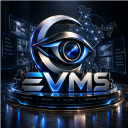
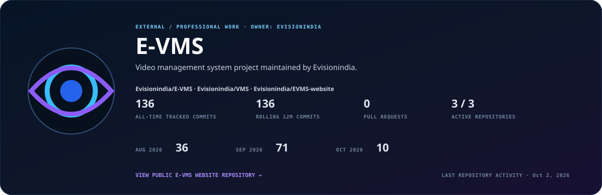
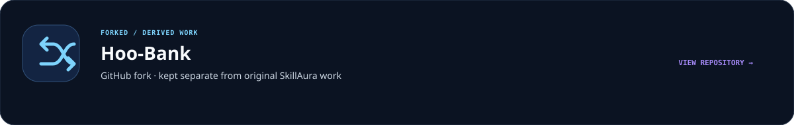

  

A portfolio of software products, web platforms, automation projects, and engineering work.

## Total Tracked Portfolio Activity

Repository activity across 12 SkillAura repositories and 3 approved external professional repositories owned by Evisionindia. Forked work is reported separately. These are repository-wide metrics across all authors and automation, not personal contribution counts.

| Activity category | Repositories | All-time commits | Current year | Rolling 12m | Active 12m |
|---|---:|---:|---:|---:|---:|
| SkillAura | 12 | 424 | 411 | 413 | 11 |
| External / professional · Evisionindia | 3 | 136 | 136 | 136 | 3 |
| **Total tracked portfolio** | **15** | **560** | **547** | **549** | **14** |

<picture>
  <source media="(max-width: 600px)" srcset="./assets/github-stats-mobile.svg">
  
</picture>

## Contribution Activity

<picture>
  <source media="(max-width: 600px)" srcset="./assets/contribution-activity-mobile.svg">
  
</picture>

## SkillAura Language Footprint

Language bytes remain SkillAura-only so external Evisionindia repositories are not silently mixed into the organization footprint.

## Technology Footprint

<kbd>TypeScript</kbd> &nbsp; <kbd>Python</kbd> &nbsp; <kbd>JavaScript</kbd> &nbsp; <kbd>React</kbd> &nbsp; <kbd>Node.js</kbd> &nbsp; <kbd>Docker</kbd> &nbsp; <kbd>PostgreSQL</kbd> &nbsp; <kbd>Supabase</kbd>

Technologies appearing in portfolio repositories. This is a repository footprint, not an expertise ranking.

## Recently Updated Projects

A neutral view of the four public SkillAura repositories with the latest GitHub activity.

<picture>
  <source media="(max-width: 600px)" srcset="./assets/recent-projects-mobile.svg?v=2">
  
</picture>

[Attractive Beauty Parlour](https://github.com/Skill-Aura-Official/attractive-beauty-parlour) · [Empire RPG Bot](https://github.com/Skill-Aura-Official/EmpireRPG_Bot) · [TSB Council](https://github.com/Skill-Aura-Official/TSB-Council) · [Anisha](https://github.com/Skill-Aura-Official/Anisha)

## SkillAura Project Directory

<picture>
  <source media="(max-width: 600px)" srcset="./assets/public-projects-mobile.svg?v=2">
  
</picture>

[Anisha](https://github.com/Skill-Aura-Official/Anisha) · [Attractive Beauty Parlour](https://github.com/Skill-Aura-Official/attractive-beauty-parlour) · [Empire RPG Bot](https://github.com/Skill-Aura-Official/EmpireRPG_Bot) · [Innovathon-Public](https://github.com/Skill-Aura-Official/Innovathon-Public) · [Shivratri](https://github.com/Skill-Aura-Official/Shivratri) · [SkillAura Pathfinder](https://github.com/Skill-Aura-Official/SkillAura-Pathfinder) · [SkillPath Launch](https://github.com/Skill-Aura-Official/skillpath-launch) · [TSB Council](https://github.com/Skill-Aura-Official/TSB-Council)

## Private / Closed-Source Projects

<picture>
  <source media="(max-width: 600px)" srcset="./assets/private-projects-mobile.svg">
  
</picture>

## E-VMS · External Professional Work

One professional portfolio project aggregated once from three repositories. Repository owner: **Evisionindia**.

Primary repository: **Evisionindia/E-VMS** · Related work: **Evisionindia/VMS** · [Evisionindia/EVMS-website](https://github.com/Evisionindia/EVMS-website)

## Forked / Derived Work

---

  Portfolio metrics are generated from tracked GitHub repository activity and updated automatically.

