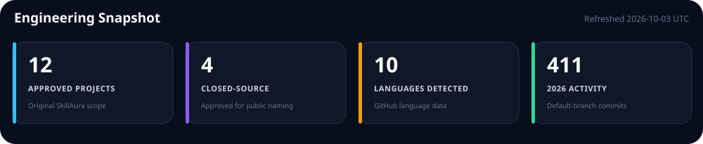
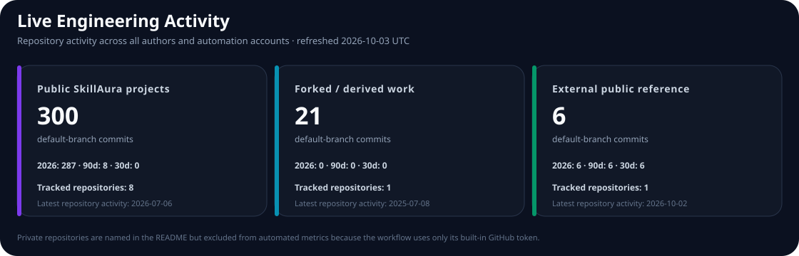
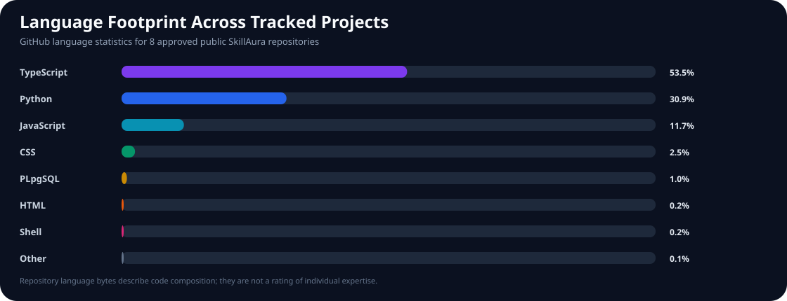

 

  

A verified portfolio of software products, web platforms, automation projects, and engineering work.

## Engineering Snapshot

## Engineering Activity Monitor

<picture>
  <source media="(max-width: 600px)" srcset="./assets/activity-mobile.svg">
  
</picture>

## Language Footprint

## Technology Footprint

      

Technologies appearing across the verified portfolio.

## Featured Projects

Four public SkillAura repositories with the most recent repository activity. Placement is not a quality ranking.

<table><tr><td width="50%" valign="top"><h3><a href="https://github.com/Skill-Aura-Official/attractive-beauty-parlour">attractive-beauty-parlour</a></h3>RECENT PUBLIC PROJECT
Beauty-parlour website with service, gallery, contact, offer, and administration interfaces.

<kbd>TypeScript</kbd> <kbd>React</kbd> <kbd>Supabase</kbd>
 Latest repository activity · 2026-07-06</td><td width="50%" valign="top"><h3><a href="https://github.com/Skill-Aura-Official/EmpireRPG_Bot">EmpireRPG_Bot</a></h3>RECENT PUBLIC PROJECT
Telegram role-playing game bot.

<kbd>Python</kbd> <kbd>Telegram</kbd>
 Latest repository activity · 2026-06-08</td></tr><tr><td width="50%" valign="top"><h3><a href="https://github.com/Skill-Aura-Official/TSB-Council">TSB-Council</a></h3>RECENT PUBLIC PROJECT
Governance documentation repository.

<kbd>Documentation</kbd>
 Latest repository activity · 2026-05-30</td><td width="50%" valign="top"><h3><a href="https://github.com/Skill-Aura-Official/Anisha">Anisha</a></h3>RECENT PUBLIC PROJECT
Telegram music-streaming bot implemented primarily in Python.

<kbd>Python</kbd> <kbd>Telegram</kbd> <kbd>Docker</kbd>
 Latest repository activity · 2026-05-30</td></tr></table>

## SkillAura Project Directory

<table><tr><td width="50%" valign="top"><h3><a href="https://github.com/Skill-Aura-Official/Anisha">Anisha</a></h3>PUBLIC REPOSITORY
Telegram music-streaming bot implemented primarily in Python.

<kbd>Python</kbd> <kbd>Telegram</kbd> <kbd>Docker</kbd>
</td><td width="50%" valign="top"><h3><a href="https://github.com/Skill-Aura-Official/attractive-beauty-parlour">attractive-beauty-parlour</a></h3>PUBLIC REPOSITORY
Beauty-parlour website with service, gallery, contact, offer, and administration interfaces.

<kbd>TypeScript</kbd> <kbd>React</kbd> <kbd>Supabase</kbd>
</td></tr><tr><td width="50%" valign="top"><h3><a href="https://github.com/Skill-Aura-Official/EmpireRPG_Bot">EmpireRPG_Bot</a></h3>PUBLIC REPOSITORY
Telegram role-playing game bot.

<kbd>Python</kbd> <kbd>Telegram</kbd>
</td><td width="50%" valign="top"><h3><a href="https://github.com/Skill-Aura-Official/Innovathon-Public">Innovathon-Public</a></h3>PUBLIC REPOSITORY
Public hackathon-platform repository.

<kbd>JavaScript</kbd>
</td></tr><tr><td width="50%" valign="top"><h3><a href="https://github.com/Skill-Aura-Official/Shivratri">Shivratri</a></h3>PUBLIC REPOSITORY
Python sketch animation created for Maha Shivratri.

<kbd>Python</kbd>
</td><td width="50%" valign="top"><h3><a href="https://github.com/Skill-Aura-Official/SkillAura-Pathfinder">SkillAura-Pathfinder</a></h3>PUBLIC REPOSITORY
Gamified career-intelligence web application.

<kbd>TypeScript</kbd> <kbd>React</kbd>
</td></tr><tr><td width="50%" valign="top"><h3><a href="https://github.com/Skill-Aura-Official/skillpath-launch">skillpath-launch</a></h3>PUBLIC REPOSITORY
SkillMatchr job and career portal with job-seeker and recruiter interfaces.

<kbd>TypeScript</kbd> <kbd>React</kbd> <kbd>Supabase</kbd>
</td><td width="50%" valign="top"><h3><a href="https://github.com/Skill-Aura-Official/TSB-Council">TSB-Council</a></h3>PUBLIC REPOSITORY
Governance documentation repository.

<kbd>Documentation</kbd>
</td></tr></table>

## Private / Closed-Source

Approved for public naming. Source, private links, repository-level metrics, and implementation details remain private.

<table><tr><td width="50%" valign="top"><h3>kiru</h3>PRIVATE / CLOSED SOURCE
Closed-source recruitment workflow platform.

<kbd>Private / Closed Source</kbd>
</td><td width="50%" valign="top"><h3>SSB</h3>PRIVATE / CLOSED SOURCE
Closed-source Telegram role-playing game project.

<kbd>Private / Closed Source</kbd>
</td></tr><tr><td width="50%" valign="top"><h3>nyther-userbot</h3>PRIVATE / CLOSED SOURCE
Closed-source Telegram userbot project.

<kbd>Private / Closed Source</kbd>
</td><td width="50%" valign="top"><h3>TenderIQ</h3>PRIVATE / CLOSED SOURCE
Closed-source tender workflow platform.

<kbd>Private / Closed Source</kbd>
</td></tr></table>

## Forked / Derived Work

<table><tr><td width="50%" valign="top"><h3><a href="https://github.com/Skill-Aura-Official/Hoo-Bank">Hoo-Bank</a></h3>FORKED / DERIVED WORK
GitHub fork / derived repository. It is not counted as original SkillAura work.

<kbd>Forked / Derived</kbd>
</td><td width="50%" valign="top"></td></tr></table>

## Selected External / Collaborative Work

These projects retain their actual GitHub ownership and are not counted as SkillAura-owned repositories.

<table><tr><td width="50%" valign="top"><h3>E-VMS</h3>OWNER · Evisionindia EXTERNAL / COLLABORATIVE
Private Evisionindia repository represented as approved external work.

<kbd>External / Collaborative</kbd>
</td><td width="50%" valign="top"><h3>VMS</h3>OWNER · Evisionindia EXTERNAL / COLLABORATIVE
Private Evisionindia repository represented as approved external work.

<kbd>External / Collaborative</kbd>
</td></tr><tr><td width="50%" valign="top"><h3><a href="https://github.com/Evisionindia/EVMS-website">EVMS-website</a></h3>OWNER · Evisionindia EXTERNAL / COLLABORATIVE
Public E-VMS website repository owned by Evisionindia.

<kbd>External / Collaborative</kbd>
</td><td width="50%" valign="top"></td></tr></table>

---

  Activity is generated from approved tracked GitHub repository data across all authors and automation accounts and updated automatically.

